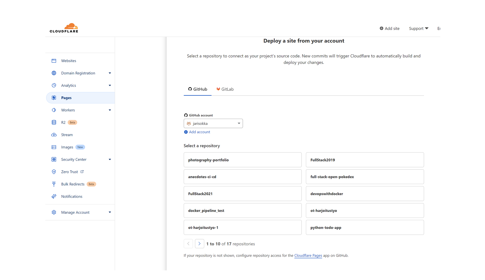
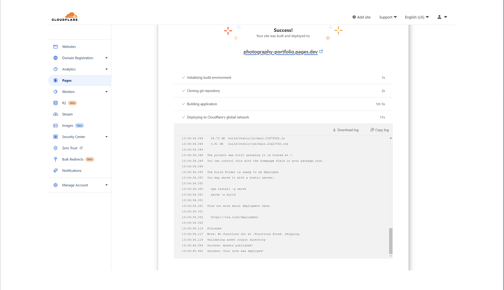
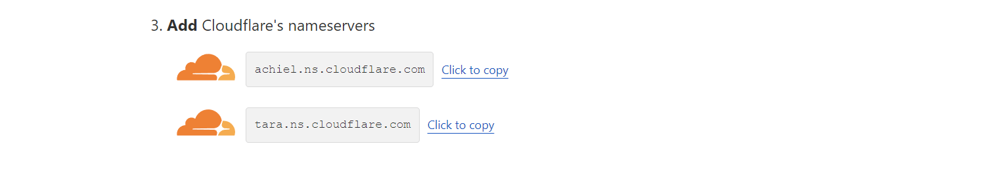
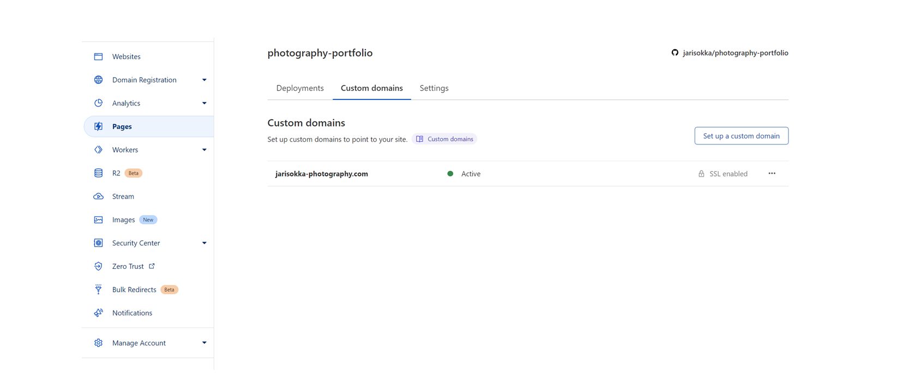

## Asennus

1. Asenna riippuvuudet komennolla:
```bash
npm install
```

2. Sivuston käynnistys:
```bash
npm start
```

Sivut ovat nyt kehitysympäristössä osoitteessa http://localhost:3000.


3. Sivujen tuotantoversion luominen:
```bash
npm run build
```

Tuotantoversio luodaan kansioon `build`.


4. Koodin tyylin tarkastus:
```bash
npm run eslint
```

## Rakenne

Sivujen hakemistorakenne on seuraava:

```bash
photography-portfolio\src
|---assets
|   ---data
|   ---images
|       |---birds
|       |---finland
|       |---macros
|       |---mammals
|       |---recent
|       |---winter
|       |---world
|---components
    ---about
    ---contact
    ---footer
    ---gallery
    ---header
    ---landing
    ---recent
```

Kansioon `assets` on koottu käytettävät kuvat sekä niihin liittyvät tiedot. Nämä on jaettu alikansioihin `data` ja `images`. Kuvat on lisäksi jaoteltu omiin alikansioihinsa. Gallerian tietoja hallitaan `gallery-data.js` kautta.
```bash
export const galleryData = [
  {
    id: 1,
    coverimage: valitse tähän kansikuva tietokannasta,
    gategory: 'Tyylilaji',
    title: 'Otsikko',
    description: 'Kerro jotain kansion kuvista',
    images: tietokannanNimi
  }
```
Yksittäinen kuvien tietokanta pitää sisällään seuraavat tiedot:
```bash
export const tietokannanNimi = [
  {
    id: 1,
    image: kuvan nimi,
    alignment: 'horizontal',
    alt: 'Winter image 1 Jari Sokka'
  }
```
 Recent osion kuvia hallitaan `slider-data.js` kautta.
```bash
export const sliderData = [
  {
    id: 1,
    image: img1,
    title: 'Small details',
    settings: '100mm f/2.8 1/160s ISO100',
    alignment: 'horizontal' ,
    alt: 'macro plant'
  }
```


Kansio `components` sisältää sivuston jokaisen osa-alueen oman kansion, jossa on tämän osuuden toiminnallisuus ja tyylien määrittely.

## Tyylit

Sivuston tyylit määritellään kahdella tasolla. Yleiset tyylin määritykset löytyvät juurihakemiston `index.css` tiedostosta. Tässä määritellään mm. käytetyt fontit, värimaailma sekä yleisen tason marginaalit ja kuvakoot. Osa-alue kohtaiset css määritykset löytyvät `components\alikansio` kohdasta kyseisen tiedoston rinnalta esim. About.js -> About.css.  

## CI/CD

Tämän hetken versio on automatisoitu päivittymään Heroku-palveluun käyttämällä GitHubin actions-toiminnallisuutta. Tähän liittyvä `yml` tiedosto löytyy kansiosta `.github\workflows`. Projektin aikana tuli kuitenkin selväksi, että Heroku toimii vain tilapäisenä ratkaisuna lähinnä siitä johtuen, että latausajat ovat kohtuullisen pitkiä etenkin tilanteessa jossa palvelin on pysähtynyt. Sivujen lopulliseksi sijoituspaikaksi valikoitui CloudFlare-palvelu, joka päivittää sivut automaattisesti kun projektin GitHub main kansiota päivitetään.

## CloudFlare

Sivun käyttöönotto CloudFlaressa tapahtuu hyvin suoraviivaisesti, etenkin kun käytössä on GitHub. `Pages` kohdasta valitaan `Create a project`, jonka jälkeen yhdistetään omaan GitHub repositorioon `Connect to Git`.

Palveluiden linkittämisen jälkeen valitaan haluttu repositorio jonka jälkeen asetuksista saadaan määriteltyä projektin nimi, päivitys haara (master) sekä Framework joka tässä tapuksessa on Create React App. CloudFlare suorittaan tuotatoon laittamisen rivakasti.




Määrittele ympäristömuuttujat kohdasta `Pages` -> `Settings` -> `Environment variables`.

### Oman osoitteen liittäminen sivustoon

Tämä vaihe edellyttää, että haluttu nettiosoite on hankitty ja rekisteröity. Tätä projektia varten `jarisokka-photography.com` osoite hankittiin Google Domain palvelun kautta.

Valitse vasemmalta päävalikosta `Websites` ja tämän jälkeen luo uusi sivusto `Add a Site`. Anna sivustolle sama nimi, jonka olet rekisteröinyt itsellesi. Valitse tarjottavista palveluista itsellesi sopiva vaihtoehto, tässä käytettiin ilmaista versiota, paina `Continue`.

`Review DNS records` kohdassa voit tarkastaa tai muuttaa tarvittaessa DNS tietoja. Uuden osoitteen ollessa kysessä tässä kohdassa ei tietoja ole paljoa esillä.

`Change your nameservers` antaa sinulle käytettävät nimipalvelimien nimet. Kopioi nämä ja korvaa nykyiset nimipalvelimen osoitteet. Esimerkiksi Google Domains nämä tulevat kohtaan `DNS` -> `Custom name servers`.



Lopuksi määrittele tietoturva-asetukset ja siirry seuraavaan kohtaan. `Overview` kohdassa näet vielä yhteenvedon uudesta sivustosta. Paina vielä lopuksi `Check nameservers`. Tarkastuksen jälkeen saat vahvistuksen sähköpostiisi ja voit siirtyä seuraavaan vaiheeseen.

Lopuksi liitetään aikaisemmin luodut sivut haluttuun osoitteeseen. Valitse `Pages` -> `Custom domains` -> `Set up Custom domain`. Kirjoita osoite jonka edellisessä vaiheessa loit ja paina `Continue`. Osoitteiden reititys tapahtuu tämän jälkeen automaattisesti ja sivut ovat hetken päästä uuden osoitteen takana. 


